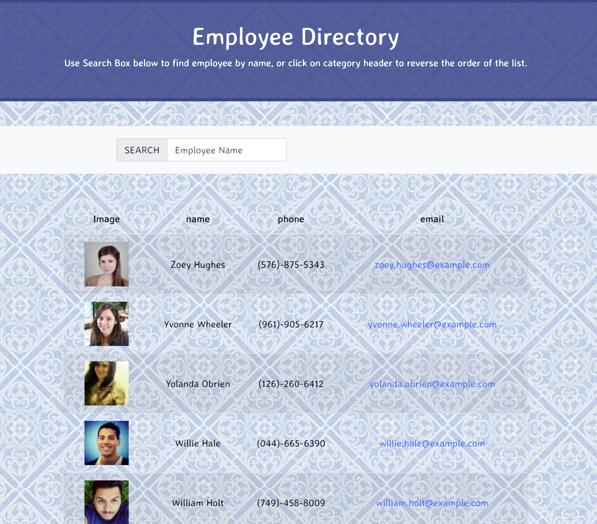

# **employeeDirectory**
An Employee directory using React
https://cfprice3.github.io/employeeDirectory/

#### *Created By Charles Price, (cfprice3)*
#### email: cfprice3@gmail.com
#### git url: https://github.com/cfprice3
#### application url: https://cfprice3.github.io/employeeDirectory/

### *Project Description:*
This is an application created to search a directory to find a specific employee to quickly access their contact information.

### *Screenshot:*

### *Animated example:*

 ## **Table of Contents**
 1. Usage
 2. Technologies Used
 3. License
 4. Contributing
 5. Questions

### **1. Usage:**
This application was created as a Directory one could use to search for a specific employee to access their email or telephone number quickly.  By inputing a name in the search box, it will filter out the other names.  Also, by clicking on either the header "name", "email", or "phone" it will change which category the order is in, as seen in the screenshot.

### **2. Technologies Used:**
The React framework was used to generate this application.  Because seed information was needed to create "employees" for the directory, the API randomuser (https://randomuser.me/) was used to generate generic information.  Bootstrap was also used for styling purposes.

### **3. License:**
["MIT", "APACHE 2.0", "GPL 3.0", "BSD 3", "None"]

### **4. How you can contribute:**
Any other suggestions or features that may add value to an application like this would be greatly appreciated.  

### **5. Questions:**
Please feel free to ask or add any questions!